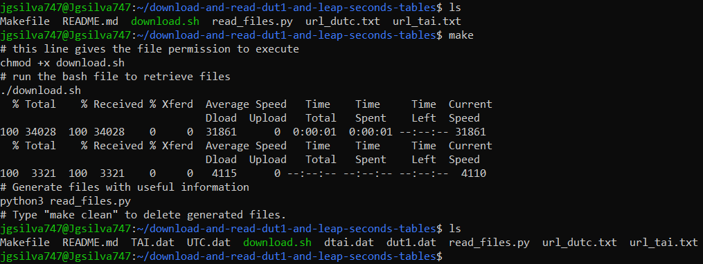
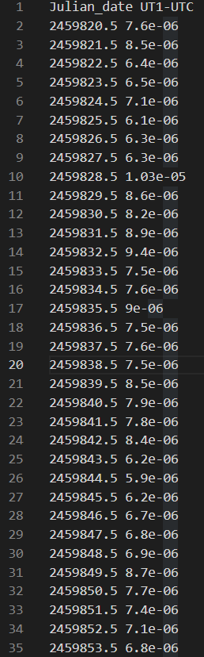

# Download and read DUT1 and leap seconds tables

## How to use

Start by cloning this repository: `git clone https://gitlab.tudelft.nl/ae4894-practical-astrodynamics/2022-2023/reports/5857732/download-and-read-dut1-and-leap-seconds-tables.git`

Afterwards, simply type `make` in the Command Line in Linux in order to run the code.

## How it works

* Firstly, a bash file is executed to retreive the tables from the urls provided in url_dutc.txt and url_tai.txt.
* Then, a python script is called to read these tables and write the useful information in new files.
* The julian date and the respective UT1-UTC are written in a file called **dut1.dat**, in two columns.
* The julian date and the respective leap seconds are written in a file called **dtai.dat**, also in two columns.
* The first line of each of these files has a legend of the data present in each column.

## Working example

* By simply typing `make`, the data is retreived from the urls (UTC.dat and TAI.dat) and the useful files are created (**dut1.dat** and **dtai.dat**)

## Data type returned

* After running the program, two output files (.dat) are produced.
* The first line of each file is a legend of the data in each collumn (e.g., Julian_date Leap_seconds)
* In the first collumn of each file, the julian date of each modification is shown.
* The second column of each file shows the respective modification (update in UT1-UTC in **dut1.dat**, and update in leap seconds in **dtai.dat**)
* The units of DUT1 = UT1-UTC and TAI - UTC (=Leap Seconds) are seconds

* Here are the first lines of the produced **dut1.dat**:

